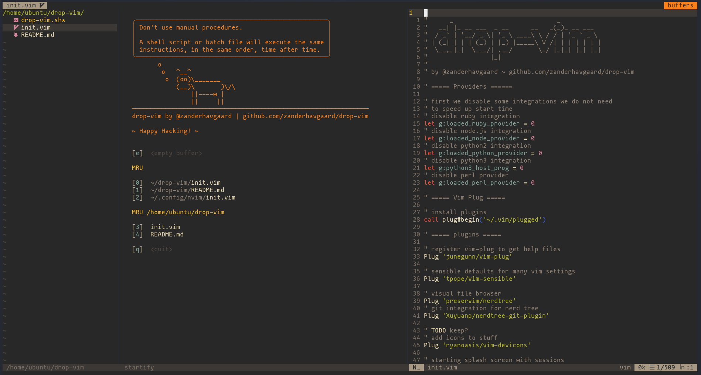

# drop-vim
Minimal vim/neovim config intended to be 'dropped' on remote servers to provide an opinionated, but minimal vim editor.

drop-vim works with either vim or neovim, if neovim is installed, it will be favoured over vim.

drop-vim should work with most relatively recent versions of vim/neovim.

drop-vim has only few dependencies, that are likely to be installed:
- `cat`
- `bash`
- `curl`
- `git`

## Usage

Clone this repository to the home directory of the current user, i.e. `~`.

Run The `drop-vim.sh` script to bootstrap the config:
```bash
bash drop-vim.sh
```

Use the options to first `copy_config` to copy the config file.
The script will favor neovim over vim, and do the neovim specific installation steps if neovim is installed, otherwise vim will be used.

Then use `install_plug` option to install the Plug plugin manager.

Finally use `install_plugins` to actually install the plugins.

```
» bash drop-vim.sh
     _                            _
  __| |_ __ ___  _ __      __   _(_)_ __ ___
 / _` | '__/ _ \| '_ \ ____\ \ / / | '_ ` _ \
| (_| | | | (_) | |_) |_____\ V /| | | | | | |
 \__,_|_|  \___/| .__/       \_/ |_|_| |_| |_|
                |_|
1) copy_config
2) install_plug
3) upgrade_plug
4) install_plugins
5) update_plugins
6) exit
#?
```

That's it neovim/vim is now configured and ready to be used.
The local repository can now be safely deleted, or kept to pull any future updates.
